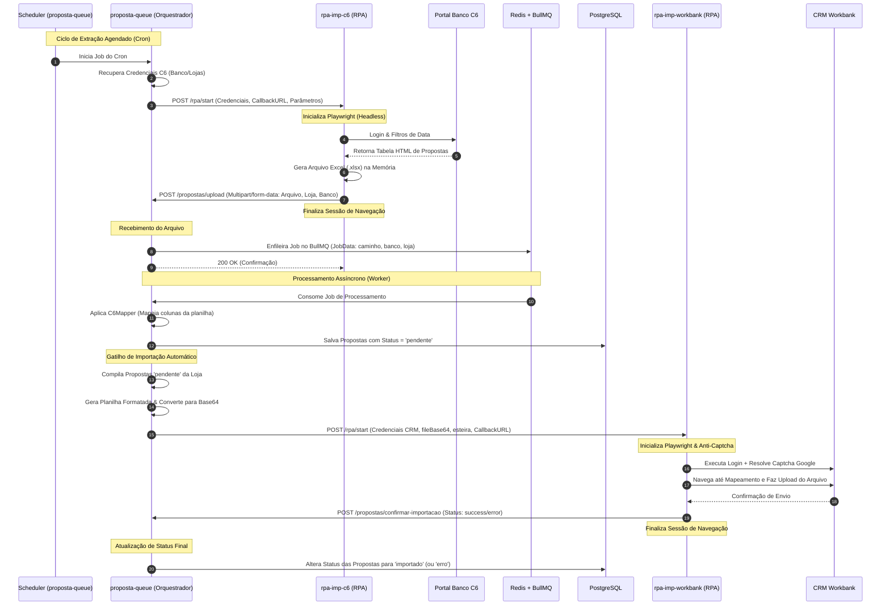

# Visão Geral da Arquitetura (To-Be)

Este documento descreve a arquitetura de software proposta para a reescrita do pipeline de automação da **CORBAN**. O sistema foi projetado sob os princípios de **Clean Architecture** (Arquitetura Limpa) organizados em um **Monorepo** NestJS, focado no desacoplamento estrito entre os módulos de orquestração, armazenamento e automação de interface de usuário (RPAs).

---

## 1. Princípios de Arquitetura e Decidabilidade

### Desacoplamento Estrito (Regra Rígida)
Nas versões legadas, os scripts de RPA possuíam conexões diretas com bancos de dados e consumiam APIs externas de controle e registro de logs (como `fycentral` e `api_central`). Na nova arquitetura, **os RPAs são completamente stateless (sem estado) e passivos**.
1. **Sem Conexão Direta**: Os RPAs (`rpa-imp-c6` e `rpa-imp-workbank`) não possuem credenciais de banco de dados, chaves de API globais ou lógica de agendamento interno.
2. **Controle via Payloads**: Tudo o que um RPA precisa para executar (credenciais de acesso aos portais dos bancos/CRM, parâmetros de busca, chaves de resolução de captcha temporárias e URLs de retorno) deve ser passado no payload da requisição HTTP `POST /rpa/start`.
3. **Comunicação por Callbacks**: Ao finalizar (com sucesso ou falha), o RPA faz um post de resposta no `callbackUrl` fornecido pelo orquestrador central, enviando o resultado ou planilha gerada em formato Base64 ou Multipart.
4. **Logs Simplificados**: Toda a instrumentação dos RPAs utilizará o logger nativo do NestJS para saída padrão (`stdout`/`stderr`), que será coletada pela stack de containerização.

---

## 2. Estrutura do Monorepo

O projeto está organizado como um monorepo usando Workspaces (Yarn ou NPM), centralizando dependências de desenvolvimento, configurações de TypeScript e Docker.

```
ceobots-monorepo/
├── package.json                 # Definição do workspace e scripts de execução global
├── docker-compose.yml           # Orquestração do Postgres, Redis e das 3 aplicações
├── proposta-queue/              # Aplicação central de Orquestração, Fila e Banco de Dados
│   ├── src/                     # NestJS Core (TypeORM, BullMQ, Scheduler)
│   └── Dockerfile
├── rpa-imp-c6/                  # Microserviço RPA para extração do Portal C6
│   ├── src/                     # NestJS + Playwright (Firefox Stealth)
│   └── Dockerfile
└── rpa-imp-workbank/            # Microserviço RPA para importação do CRM Workbank
    ├── src/                     # NestJS + Playwright + Resolvedor de Captcha
    └── Dockerfile
```

---

## 3. Fluxo de Dados e Ciclo de Vida do Processamento

O fluxo de dados é assíncrono e coordenado pela aplicação `proposta-queue` usando mensageria baseada em Redis.



### Detalhamento dos Passos:
1. **Agendamento**: O `proposta-queue` possui um serviço agendador (`@nestjs/schedule`) que monitora as tarefas.
2. **Gatilho de Extração**: O orquestrador dispara a API do C6 RPA passando chaves e parâmetros de consulta.
3. **Raspagem**: O `rpa-imp-c6` acessa o portal C6 Consig, simula as interações humanas, raspa a tabela e cria uma planilha excel.
4. **Callback de Upload**: O `rpa-imp-c6` envia a planilha de volta ao `proposta-queue` via endpoint `/propostas/upload`.
5. **Enfileiramento**: O `proposta-queue` salva o arquivo fisicamente em um diretório temporário e envia o job de processamento para a fila `proposta` gerenciada pelo **BullMQ**.
6. **Mapeamento e Persistência**: O Worker consome o job, carrega o arquivo XLSX com a biblioteca `xlsx`, executa o `C6Mapper` para padronizar os dados e salva os registros na tabela `Proposta` do PostgreSQL com o status inicial `pendente`.
7. **Gatilho de CRM**: Logo após salvar, o orquestrador detecta novas propostas pendentes, compila-as em uma nova planilha formatada no layout aceito pelo CRM e envia via payload Base64 para a API do `rpa-imp-workbank`.
8. **Importação no CRM**: O RPA do CRM faz login resolvendo o reCAPTCHA via API do **Anti-Captcha**, navega até a tela de Mapeamento de Arquivos e realiza o upload.
9. **Finalização**: O RPA do CRM chama o endpoint `/propostas/confirmar-importacao` no orquestrador informando o sucesso. O orquestrador então atualiza todas as propostas daquela planilha para o status `importado`.

---

## 4. O Papel do Redis e do BullMQ

O **Redis** é utilizado como o banco de dados em memória de alta performance que serve de backend para o **BullMQ**. Essa stack garante:
- **Resiliência contra Quedas**: Se a aplicação do Worker cair durante o processamento de uma planilha pesada, o estado da fila é mantido no Redis e o job é reprocessado assim que o serviço se recuperar.
- **Retry Automático**: Falhas temporárias (como timeouts de IO ao ler a planilha) possuem políticas de re-tentativa com backoff exponencial configurados no BullMQ.
- **Limite de Concorrência**: Como os portais dos bancos e o CRM podem bloquear acessos simultâneos vindos das mesmas credenciais (Session Lock), as filas BullMQ serão configuradas com concorrência estrita (`concurrency: 1` por loja/banco) para evitar execuções simultâneas concorrentes do RPA.
- **Desacoplamento Temporal**: A API HTTP do orquestrador responde imediatamente `202 Accepted` ao receber o webhook do RPA, deixando o trabalho pesado de IO e persistência de dados para o worker em background.

---

## 5. Modelagem do Banco de Dados (PostgreSQL)

A tabela principal no banco PostgreSQL armazena as propostas e o histórico de importação para auditoria.

### Tabela `proposta`
```sql
CREATE TABLE proposta (
    id UUID PRIMARY KEY DEFAULT gen_random_uuid(),
    banco VARCHAR(50) NOT NULL,               -- Ex: 'C6 Bank'
    valor DECIMAL(12, 2) NOT NULL,            -- Valor líquido/contrato
    cliente VARCHAR(255) NOT NULL,            -- Nome do cliente
    produto VARCHAR(100) NOT NULL,            -- Ex: 'Margem Livre', 'Refinanciamento'
    status VARCHAR(50) DEFAULT 'pendente',    -- 'pendente', 'processando', 'importado', 'erro'
    loja VARCHAR(50),                         -- Identificador da filial/loja
    dados_originais JSONB,                    -- Payload completo raspado do banco original
    created_at TIMESTAMP DEFAULT NOW(),
    updated_at TIMESTAMP DEFAULT NOW()
);
```
*Nota: A coluna `dados_originais` do tipo `JSONB` armazena a linha exata extraída da planilha original, o que garante a rastreabilidade caso as regras de mapeamento precisem ser atualizadas retroativamente.*

---

## 6. Docker & Orchestration

O desenvolvimento local e o deploy são simplificados através do arquivo `docker-compose.yml` que orquestra a infraestrutura necessária:

1. **`postgres`**: Banco de dados relacional principal.
2. **`redis`**: Cache e gerenciador de filas para o BullMQ.
3. **`proposta-queue`**: Aplicação de controle que escuta na porta `3000`.
4. **`rpa-imp-c6`**: API do RPA do C6 escutando na porta `3001`.
5. **`rpa-imp-workbank`**: API do RPA do CRM escutando na porta `3002`.

Todos os containers compartilham uma rede virtual interna (`corban-network`) garantindo comunicação de baixa latência usando nomes de host DNS internos do Docker.
